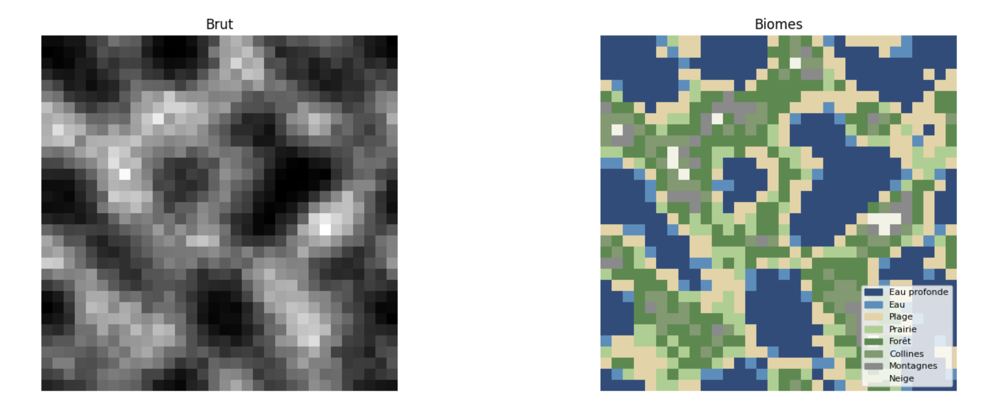
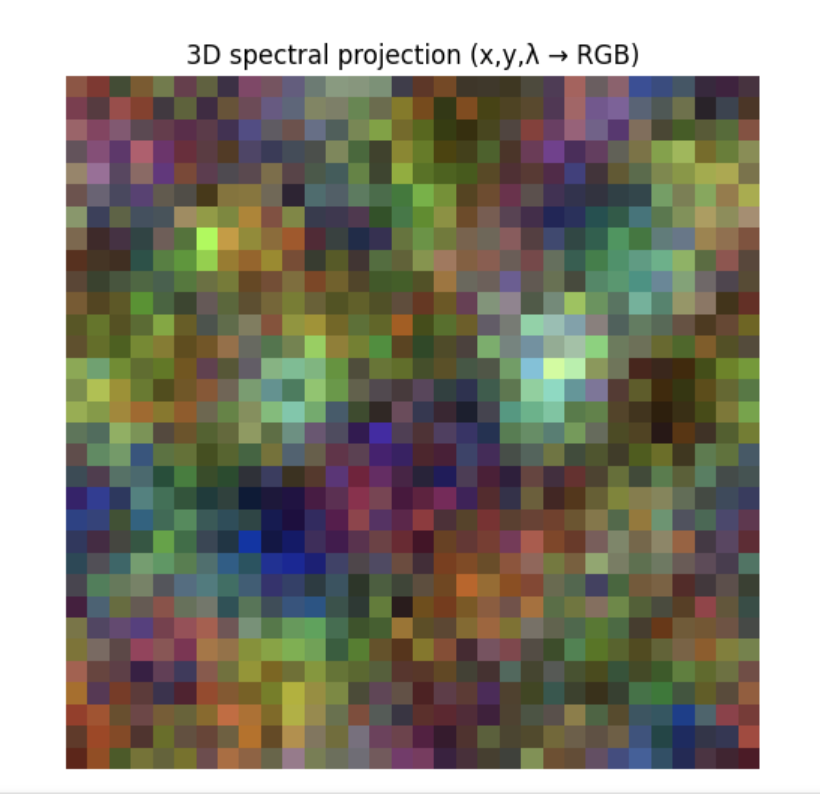
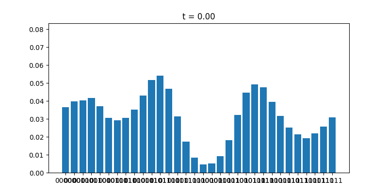
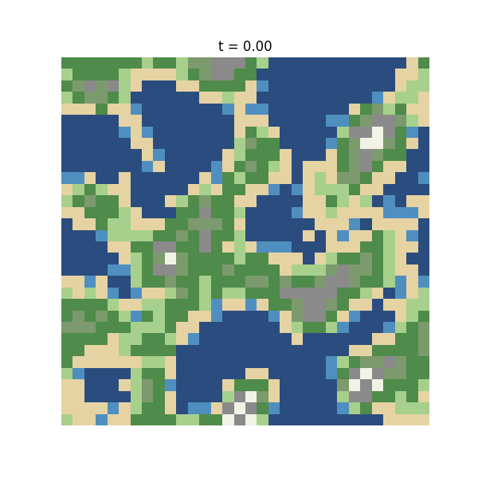
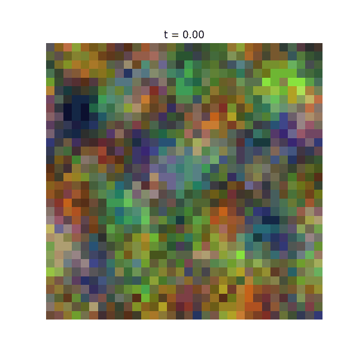

# Quantum Perlin Noise (N-Dimensional)

This project explores the generation of **Perlin-like noise in N dimensions using quantum computing techniques**.

The main idea is to build and manipulate a **probability distribution encoded in a quantum circuit**, then apply quantum transformations to obtain smooth, structured noise similar to classical Perlin noise.

---

## Overview

Instead of computing gradients as in classical Perlin noise, this approach relies on:

* Quantum state preparation
* Probability distribution encoding
* Quantum interpolation techniques

The result is a **quantum-generated noise field** that can be extended to arbitrary dimensions.

---

## Method

### 1. Probability Distribution Generation

A random probability distribution is created. This distribution acts as the base signal for the noise.

---

### 2. Quantum State Encoding

The probability distribution is encoded into a quantum circuit using a state preparation method (e.g. Grover-Rudolph algorithm).

This maps classical probabilities into quantum amplitudes.

---

### 3. Resolution Increase with Ancilla Qubits

To increase precision and resolution:

* Additional qubits (ancilla qubits) are added
* These qubits are not directly involved in the initial state preparation
* They expand the representable state space

This allows finer-grained sampling of the distribution.

---

### 4. QFT Interpolation (Smoothing)

A Quantum Fourier Transform (QFT) is applied to the state.

This step acts as an interpolation mechanism that:

* Smooths the probability distribution
* Reduces sharp transitions
* Produces Perlin-like continuity

---

## Results

### 1D
A smooth probability distribution emerges, resembling classical Perlin noise in one dimension.


### 2D

The system generates structured maps similar to **Minecraft-style biomes**, with coherent spatial regions.


### 3D

A voxel representation is produced, where:

* X and Y define position
* Z or color encodes additional structure



## Time Evolution

A temporal dimension has been added to simulate evolving noise.

### Process:

1. Two distributions are generated:

   * Distribution **A**
   * Distribution **B**

2. For each time step `t`:

   * A quantum circuit is built
   * The system is simulated
   * The result interpolates between A and B

3. Over **N frames**, the system transitions smoothly from A → B.

This produces **animated quantum noise evolution**.




---

## Multi-Dimensional Coordinate Extraction

To extract coordinates from measurement results:

* The measured bitstring is split into chunks
* Each chunk corresponds to one dimension
* Chunk size depends on the chosen resolution

### Example

```
|00001 00110⟩ → 00001 | 00110 → (1, 3)
```

So:

* `00001` → 1
* `00110` → 3

This method generalizes to N dimensions by increasing the number of chunks.

---

## Pseudo Code (Python)

```python
if __name__ == "__main__":

	# The resolution parameter defines the size of the output. So increase it or reduce it as needed

    # ── 1D animation ─────────────────────────────────────────────────────
    gen1d = PerlinGenerator(
        n_dimmensions=1, resolution=3,
        distrib="random", seed=42,
        n_frames=60, interp="cosine",
    )
    gen1d.simulate()
    gen1d.animate(interval=200, save_path="perlin_1d.gif")

    # ── 2D animation (carte + biomes) ────────────────────────────────────
    gen2d = PerlinGenerator(
        n_dimmensions=2, resolution=3,
        distrib="random", seed=0,
        n_frames=60, interp="cosine",
    )
    gen2d.simulate()
    gen2d.animate(interval=200, save_path="perlin_2d.gif")

    # ── 3D animation spectrale ───────────────────────────────────────────
    gen3d = PerlinGenerator(
        n_dimmensions=3, resolution=3,
        distrib="random", seed=7,
        n_frames=60, interp="cosine",
    )
    qc = gen3d.get_circuit()
    print(qc)
    
    gen3d.simulate()
    gen3d.animate(interval=200, save_path="perlin_3d.gif")
```

---

## Project Evolution

* Added **3D visualization** with color as an additional dimension
* Refactored the code into a **class-based architecture**
* Introduced **temporal evolution (noise animation over time)**
* Improved quantum circuit structure and modularity
* Added time dimension
---

## References

1. [https://qetel.usal.es/blog/quantum-perlin-noise#_ednref1](https://qetel.usal.es/blog/quantum-perlin-noise#_ednref1)
2. [https://qetel.usal.es/blog/quantum-perlin-noise-ii-generating-worlds](https://qetel.usal.es/blog/quantum-perlin-noise-ii-generating-worlds)
3. [https://arxiv.org/pdf/2310.19309](https://arxiv.org/pdf/2310.19309)
4. [https://arxiv.org/pdf/quant-ph/0208112](https://arxiv.org/pdf/quant-ph/0208112)
5. [https://arxiv.org/pdf/2203.06196](https://arxiv.org/pdf/2203.06196)
6. [https://medium.com/qiskit/introducing-procedural-generation-using-quantum-computation-956e67603d95](https://medium.com/qiskit/introducing-procedural-generation-using-quantum-computation-956e67603d95)
7. [https://medium.com/qiskit/introducing-a-quantum-procedure-for-map-generation-eb6663a3f13d](https://medium.com/qiskit/introducing-a-quantum-procedure-for-map-generation-eb6663a3f13d)
8. [https://arxiv.org/pdf/2203.06196](https://arxiv.org/pdf/2203.06196)
