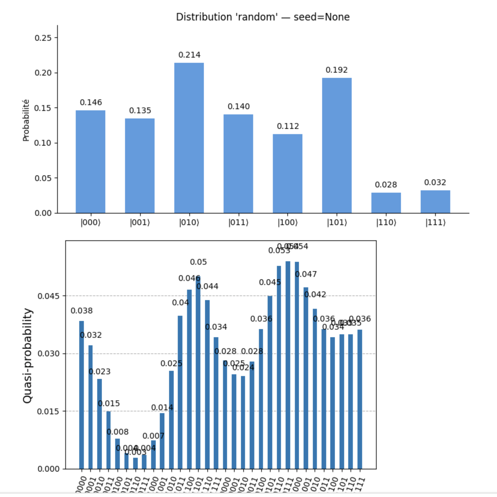

# Perlin Noise using Quantun
I am trying to produce a perlin noise and produce it to N dimmensions using quantum programming. 
My steps are : generate random amplitude for states. Then load it to quantum states using Grover Rodolph algo. Then aply qft interpolation to smooth the result.
Here are my latest outputs :
1D comparison

2D with minecraft like biome style

3D with third dimension for color

# Evolution of projet
I added a 3D visualisation with the third dimension a color map
I also cleaned the code and made it fit in a class

Sources : 
1) https://qetel.usal.es/blog/quantum-perlin-noise#_ednref1
2) https://qetel.usal.es/blog/quantum-perlin-noise-ii-generating-worlds
3) https://arxiv.org/pdf/2310.19309
4) https://arxiv.org/pdf/quant-ph/0208112
5) https://arxiv.org/pdf/2203.06196
6) https://medium.com/qiskit/introducing-procedural-generation-using-quantum-computation-956e67603d95
7) https://medium.com/qiskit/introducing-a-quantum-procedure-for-map-generation-eb6663a3f13d
8) https://arxiv.org/pdf/2203.06196
